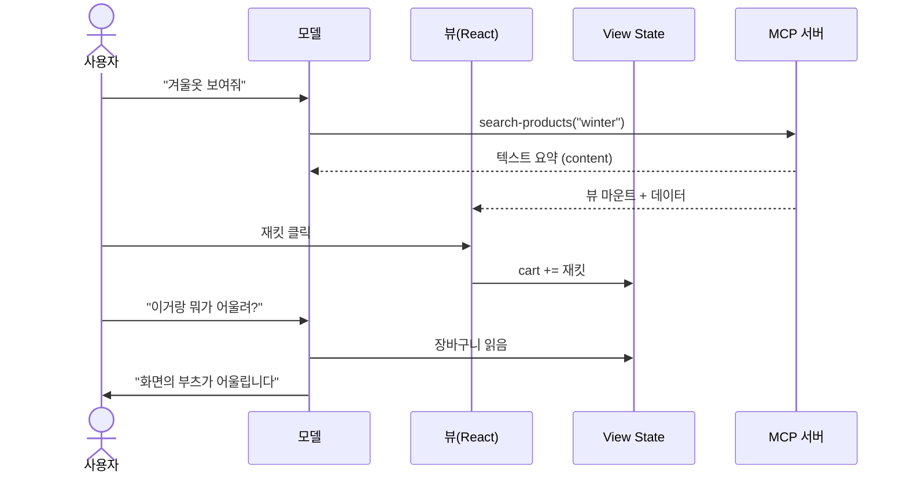

# Skybridge 전수조사 & 수익화 분석 리포트 🚀

> 작성: 카리나 (Claude Code) 💖
> 작성일: 2026-09-22
> 분석 대상 저장소: **https://github.com/bmshin94/skybridge**
> 원본(업스트림): **https://github.com/alpic-ai/skybridge**
> 공식 문서: https://docs.skybridge.tech · 공식 사이트: https://www.skybridge.tech

---

## 목차

1. [Skybridge란 무엇인가](#1-skybridge란-무엇인가)
2. [쉽게 이해하기](#2-쉽게-이해하기)
3. [Q&A 7문답](#3-qa-7문답)
4. [수익화 아이디어 상세](#4-수익화-아이디어-상세)
5. [참고 링크](#5-참고-링크)

---

## 1. Skybridge란 무엇인가

### 1.1 한 줄 정의

**AI 채팅창(ChatGPT / Claude) 안에서 렌더링되는 React 앱을 만드는 풀스택 TypeScript 프레임워크.**

- 제작사: **Alpic** (프랑스)
- 라이선스: **MIT** (상업적 이용 자유)
- 규모: GitHub ⭐ 1,000+ / npm 월 10만 다운로드 / Claude·ChatGPT 스토어 앱의 10%+ 점유

### 1.2 해결하는 문제

| 구분 | 기존 MCP 서버 | MCP Apps (Skybridge) |
|---|---|---|
| 응답 형태 | 텍스트만 | **데이터 + React UI** |
| 사용자 인터랙션 | 불가 | 클릭·입력·드래그 가능 |
| 모델의 화면 인지 | 없음 | `useViewState` / `data-llm`으로 동기화 |

Skybridge는 서로 다른 두 런타임을 **하나의 API로 추상화**한다.

- **Apps SDK** — ChatGPT의 독점 `window.openai` 런타임
- **MCP Apps** — 개방 표준 `ext-apps` 스펙 (JSON-RPC postMessage)

→ `packages/core/src/web/bridges/get-adaptor.ts`가 로드 시점에 자동 판별한다.
이것이 **"Write once, run everywhere"** 의 실체이며 이 프레임워크 최대의 차별점이다.

### 1.3 모노레포 구조 (전수조사 결과)

```
skybridge/
├── packages/                    # npm 배포 패키지 5종
│   ├── core/                    # npm: skybridge            (본체)
│   ├── devtools/                # npm: @skybridge/devtools  (로컬 에뮬레이터)
│   ├── vite-plugin/             # npm: @skybridge/vite-plugin
│   ├── test/                    # npm: @skybridge/test      (Evals 러너)
│   └── create-skybridge/        # npm create skybridge      (스캐폴더)
├── examples/                    # 실전 예제 23개
├── docs/                        # Mintlify 문서 88개 (API 레퍼런스 39개)
├── skills/                      # AI 에이전트용 스킬 3종
├── landing/                     # Next.js 랜딩 페이지
├── infrastructure/              # AWS CDK 인프라
├── e2e/                         # Playwright E2E 테스트
└── scripts/                     # 버전 범프 등 유틸
```

TypeScript/TSX 소스 파일 약 **597개**, 문서 **88개**.

### 1.4 `packages/core` 내부

| 경로 | 역할 |
|---|---|
| `src/server/` | `Skybridge` 클래스, `registerTool`, Express 통합, OAuth 7종, 미들웨어, CSP, 스킬 디스커버리 |
| `src/web/` | React 훅 17개, 런타임 어댑터(bridges), `data-llm`, `createStore`, `mountView` |
| `src/cli/` | oclif 기반 CLI (`skybridge` / `sb`), 터널링, 포트 감지, nodemon, TS 체크 |
| `src/commands/` | `dev` / `build` / `start` / `create` 구현 |
| `src/views/` | 뷰 런타임 |

### 1.5 React 훅 전체 목록

| 훅 | 용도 |
|---|---|
| `useCallTool` | 뷰에서 서버 도구 직접 호출 |
| `useToolInfo` | 도구 결과(output / responseMetadata) 타입세이프 읽기 |
| `useViewState` | **모델과 공유되는 상태** (리마운트 후에도 유지) |
| `useDisplayMode` | inline / fullscreen / pip 전환 |
| `useSendFollowUpMessage` | 뷰에서 모델에게 메시지 전송 |
| `useUser` | 테마 / 로케일 / 디바이스 정보 |
| `useHost` | 현재 호스트(ChatGPT/Claude) 판별 |
| `useRequestModal` | 모달 요청 |
| `useRequestSize` | iframe 크기 요청 |
| `useRequestClose` | 뷰 닫기 요청 |
| `useOpenExternal` | 외부 링크 열기 (결제 페이지 등) |
| `useDownload` | 사용자 파일시스템에 저장 |
| `useFiles` | 첨부 파일 처리 |
| `useViewport` | 뷰포트 정보 |
| `useSetOpenInAppUrl` | "앱에서 열기" 타깃 지정 |
| `useRegisterViewTool` | 뷰가 직접 도구 등록 |

### 1.6 OAuth 프로바이더 7종

`Auth0` · `Clerk` · `Descope` · `Stytch` · `WorkOS` · `Authplane` · `Custom`
→ 각각에 대응하는 **완성된 예제 앱**이 `examples/auth-*` 에 존재.

### 1.7 예제 23종

| 카테고리 | 예제 |
|---|---|
| 기본 | `everything`, `chess`, `times-up` |
| 유스케이스 | `capitals`, `flight-booking`, `ecom-carousel`, `productivity`, `investigation-game` |
| 인증 | `auth-auth0`, `auth-clerk`, `auth-descope`(+alpic/mixed), `auth-stytch`, `auth-workos`, `auth-authplane` |
| UI 라이브러리 | `generative-ui`, `mcpcn`, `manifest-ui`, `openui-generative-ui` |
| 기타 | `supabase-triplog`, `chatgpt-files`, `evals` |

### 1.8 핵심 설계 개념 — "누가 무엇을 보는가"

MCP 앱에는 **3명의 행위자**가 있다: **사용자 / 모델 / 뷰**.
모델은 **화면을 볼 수 없다.** 따라서 "누가 무엇을 보는지"를 개발자가 명시적으로 설계해야 한다.

도구 응답 필드별 수신자:

| 필드 | 모델이 봄 | 뷰가 봄 | 용도 |
|---|:---:|:---:|---|
| `content` | O | X | 모델용 텍스트 요약 |
| `structuredContent` | O | O | 양쪽이 공유하는 핵심 데이터 |
| `_meta` | X | O | **대용량 데이터** (모델 컨텍스트 절약) |

> 실제 `examples/capitals`는 전 세계 수도 목록 전체를 `_meta.allCapitals`에 담아
> 모델 토큰을 소모하지 않으면서 지도에는 전부 렌더한다.

상태 채널 구분:

| API | 모델이 봄 | 리마운트 후 유지 |
|---|:---:|:---:|
| `useViewState` | O | O |
| `useState` (React) | X | X |
| `data-llm` 속성 | O (텍스트로 서술) | - |

### 1.9 타입 안전성 (tRPC 스타일)

```ts
// helpers.ts
import { generateHelpers } from "skybridge/web";
import type { AppType } from "./server.js";

export const { useCallTool, useToolInfo } = generateHelpers<AppType>();
```

서버의 zod 스키마가 React 컴포넌트까지 그대로 추론된다.
서버 필드명을 바꾸면 프론트엔드에서 즉시 타입 에러가 발생한다.

### 1.10 DevTools (로컬 에뮬레이터)

`npm run dev` 하나로 뜨는 것:

- `http://localhost:3000/mcp` — MCP 서버 엔드포인트
- `http://localhost:3000/` — DevTools

제공 기능:

- 입력 스키마 기반 **도구 입력폼 자동 생성**
- 응답 전체 인스펙션 (`content` / `structuredContent` / `_meta` + 지연시간 + 페이로드 크기)
- **State 인스펙터** — 모델이 보는 상태를 JSON 트리로 실시간 표시
- **ChatGPT / Claude 대화창 목업 프리뷰** (라이트·다크, 모바일 390×844 프레임)
- **컨텍스트 경고** — 도구 출력 5,000 토큰 / 뷰 상태 20,000 토큰 초과 시 경고
- **콜 로그** — `setViewState`, `callTool`, `requestDisplayMode` 전부 기록

### 1.11 AI 에이전트용 스킬

`skills/` 에 3종의 에이전트 스킬이 동봉되어 있다.

- `skybridge` — 전체 라이프사이클 가이드
- `mcp-app-builder` — MCP 앱 특화
- `chatgpt-app-builder` — ChatGPT 앱 특화 (`references/` 19개 + `evals/` 테스트 포함)

설치:
```bash
npx skills add alpic-ai/skybridge -s skybridge
```

이 저장소에는 `CLAUDE.md`, `AGENTS.md`, `GEMINI.md`가 모두 존재하여
어떤 코딩 에이전트로도 작업할 수 있도록 설계되어 있다.

### 1.12 앱 라이프사이클



**3단계**: 마운트(도구 호출) → 실행(사용자 인터랙션) → 티어다운(대화 종료).
각 뷰 인스턴스는 자신의 상태를 가지며, 재마운트 시 상태가 복원된다.

### 1.13 이 프레임워크가 나에게 주는 이점

1. **ChatGPT / Claude 스토어라는 신규 유통 채널** 선점
2. **React 지식만으로 진입 가능** — 새 언어 학습 불필요
3. **OAuth · CSP · 배포 등 번거로운 부분이 이미 해결됨**
4. **로컬 에뮬레이터** — 배포 없이 전체 UX 검증 가능
5. **MIT 라이선스 + 자체 호스팅 자유** — 벤더 락인 최소

---

## 2. 쉽게 이해하기

### 2.1 "AI 채팅방 = 새로운 앱스토어"

앱스토어 초기에 먼저 진입한 개발자들이 큰 성과를 냈듯,
지금 ChatGPT와 Claude가 그 앱스토어를 열고 있다.
Skybridge는 **그 스토어에 넣을 앱을 만드는 공장 설비**다.

### 2.2 피자집 비유

**기존 MCP (텍스트만)**
> 손님: "피자 뭐 있어요?"
> 직원: "마르게리타 12,000원, 페퍼로니 15,000원, 고르곤졸라 16,000원…" (텍스트 나열)

**MCP Apps (Skybridge)**
> 손님: "피자 뭐 있어요?"
> 직원: "여기 메뉴판이요!" → **사진이 있는 메뉴판이 채팅창 안에 렌더링**
> 손님이 페퍼로니 이미지를 **터치**
> 직원: "페퍼로니 고르셨네요, 음료도 추가하실래요?" ← **터치한 사실을 AI가 인지**

핵심은 **"AI가 화면 상태를 알아본다"** 는 점이다.

### 2.3 세 명이 함께 쓰는 앱

| 행위자 | 하는 일 | 보지 못하는 것 |
|---|---|---|
| 사용자 | 화면을 보고 조작 | 내부 데이터 흐름 |
| 모델(AI) | 데이터를 읽고 응답 | **화면 그 자체** |
| 뷰(React) | 렌더링과 반응 | — |

모델은 시각이 없으므로, 개발자가 명시적으로 알려줘야 한다.

```tsx
// data-llm 속성이 모델에게 현재 화면 상태를 문장으로 전달한다
<div data-llm={`장바구니에 ${cart.length}개 담김`}>
  <ProductList />
</div>
```

### 2.4 폴더를 집에 비유하면

| 폴더 | 비유 |
|---|---|
| `packages/core` | 집의 뼈대와 배관 (실제 알맹이) |
| `packages/devtools` | 거울 — 배포 전 미리 확인 |
| `packages/create-skybridge` | 모델하우스 배달 — 집을 즉시 생성 |
| `examples/` | 인테리어 사진첩 23장 |
| `docs/` | 사용설명서 88장 |
| `skills/` | AI 집사 매뉴얼 |

### 2.5 실제 개발 흐름

```
1. npx skybridge create my-app     → 프로젝트 생성
2. npm run dev                      → localhost:3000 에뮬레이터
3. 코드 수정 → 저장                  → HMR로 즉시 반영
4. npm run dev -- --tunnel          → 공개 URL 발급 → ChatGPT/Claude 연결
5. npm run deploy                   → 배포
```

### 2.6 한 줄 결론

> **React를 할 줄 알면, ChatGPT와 Claude 안에서 동작하는 앱을 만들 수 있게 해주는 도구.**

---

## 3. Q&A 7문답

### Q1. 설치 및 사용법은?

**사전 준비**

```bash
node -v                        # v24.18.0 이상 (.nvmrc 명시)
corepack enable && pnpm -v     # pnpm 10+
```

**새 앱 생성 (권장)**

```bash
npx skybridge create my-app
# 또는
npm create skybridge@latest my-app
```

템플릿 선택지:
- `demo` — 도구 2개(`start`, `get-fortune-cookie`) + 뷰 1개 포함
- `blank` — 최소 구성

예제에서 시작:
```bash
npx skybridge create my-app --example ecom-carousel
npx skybridge create my-app --example auth-descope
```

**이 저장소 자체를 실행**

```bash
pnpm install
pnpm build
cd examples/capitals && pnpm dev
```

**CLI 명령어** (`skybridge` 또는 축약형 `sb`)

| 명령어 | 설명 |
|---|---|
| `skybridge dev` | 개발 서버 + DevTools + HMR |
| `skybridge dev --tunnel` | 위 + 공개 URL 터널 |
| `skybridge build` | 프로덕션 빌드 |
| `skybridge start` | 빌드 결과 실행 |

**검증 명령어 (기여 시)**

```bash
pnpm test    # vitest 단위 테스트 + biome ci 린트
pnpm build   # 전체 패키지 컴파일
pnpm format  # 자동 포맷 수정
```

**최소 예제**

```ts
// src/server.ts
import { Skybridge } from "skybridge/server";
import * as z from "zod";

export const app = new Skybridge({
  name: "my-app",
  version: "0.0.1",
  handler: (server) =>
    server.registerTool(
      {
        name: "greet",
        description: "인사하고 카드 뷰를 띄웁니다",
        inputSchema: { name: z.string() },
        view: { component: "greet-card" },
      },
      async ({ name }) => ({
        structuredContent: { name },
        content: [{ type: "text", text: `${name}님께 인사했습니다` }],
      }),
    ),
});

export type AppType = typeof app;
```

```tsx
// src/views/greet-card.tsx
import { useToolInfo } from "../helpers.js";

export default function GreetCard() {
  const { output } = useToolInfo<"greet">();
  return <h1>안녕하세요 {output.name}님!</h1>;   // 타입 자동 추론
}
```

---

### Q2. 플러그인인가, 스킬인가, MCP인가?

**본질은 프레임워크이며, 나머지 셋을 모두 품고 있다.**

| 분류 | 해당 여부 | 설명 |
|---|:---:|---|
| 프레임워크 | **O (본질)** | Next.js가 React 프레임워크이듯, MCP Apps 프레임워크 |
| MCP | O (결과물) | 생성되는 앱이 `/mcp` 엔드포인트를 가진 실제 MCP 서버 |
| 플러그인 | 부분 | `@skybridge/vite-plugin`은 실제 Vite 플러그인 |
| 스킬 | 부분 | `skills/`에 AI 에이전트용 스킬 3종 동봉 |

```
Skybridge (프레임워크)
  ├─ 결과물      → MCP 서버 + React 뷰 = "MCP 앱"
  ├─ 내장 부품 ① → @skybridge/vite-plugin (Vite 플러그인)
  ├─ 내장 부품 ② → skills/ (에이전트 스킬)
  └─ 배포 대상   → ChatGPT 스토어 / Claude 커넥터 / VSCode
```

**자주 하는 오해**

- **MCP 서버 ≠ MCP 앱** — 서버는 도구(텍스트)만, 앱은 도구 + React UI
- **Claude Skill ≠ Skybridge Skill** — `skills/`는 "AI에게 이 프레임워크 사용법을 가르치는 문서"이지, 앱 자체가 스킬인 것은 아니다

---

### Q3. API 토큰이 필요한가?

**프레임워크 자체는 토큰이 전혀 필요 없다. MIT 라이선스 무료.**

| 상황 | 필요한 것 | 비용 |
|---|---|---|
| 로컬 개발 + DevTools | 없음 | 무료 |
| `--tunnel` 공개 URL | Alpic 계정 | 무료 티어 |
| Alpic Cloud 배포 | Alpic 계정 | 무료 티어 존재 |
| **자체 호스팅 (Node)** | **없음** | 완전 무료 |
| ChatGPT 앱 등록 | OpenAI 개발자 계정 | 무료 |
| Claude 커넥터 등록 | Anthropic 계정 | 무료 |

**내 앱의 기능 때문에 필요한 키** (Skybridge와 무관):

- `MAPBOX_TOKEN` (capitals 예제)
- `CLERK_SECRET_KEY`, `AUTH0_DOMAIN`, `DESCOPE_PROJECT_ID` 등 (OAuth 예제)
- `STRIPE_SECRET_KEY`, `LULU_ADS_API_KEY` (수익화 시)

**OAuth 연결은 사실상 한 줄:**

```ts
import { Skybridge, clerkProvider } from "skybridge/server";

new Skybridge({
  name: "my-app",
  oauth: clerkProvider({ domain: process.env.CLERK_DOMAIN }),
  handler: (server) =>
    server.registerTool(
      { name: "my-data", securitySchemes: [{ type: "oauth2" }] },
      async (input, extra) => {
        const userId = extra.http?.authInfo?.subject;
        // ...
      },
    ),
});
```

익명 허용과 혼합도 가능: `auth: { allowsAnonymous: true }`

---

### Q4. 왜 GitHub에서 유명한가?

**수치**: ⭐ 1,000+ / npm 월 10만 다운로드 / Claude·ChatGPT 스토어 앱의 10%+ 점유.

1. **타이밍** — MCP Apps 스펙(`ext-apps`)과 ChatGPT Apps SDK 등장 시점에 맞춰 출시
2. **Write once, run everywhere** — ChatGPT의 `window.openai`와 MCP Apps의 JSON-RPC postMessage를 어댑터로 흡수. 이게 없으면 앱을 두 번 만들어야 한다
3. **레퍼런스** — Datadog, Bitmovin, Evaneos, Touchstream, Cottages.com
4. **문서·예제 품질** — 문서 88페이지, API 레퍼런스 39개, 예제 23개(전부 라이브 데모 제공), `DOCUMENTATION-MANIFESTO.md`라는 문서 철학 파일까지 존재
5. **Agent-ready 철학** — `skills/`로 AI 에이전트가 이 프레임워크를 직접 쓰게 설계. AI 시대엔 AI가 잘 쓰는 도구가 확산된다
6. **압도적 DX** — 로컬 에뮬레이터 + HMR + 영구 터널 + tRPC급 타입 추론 + Evals
7. **MIT + 자체 호스팅 자유** — 호스팅으로 수익을 내면서도 Node 환경 어디서나 셀프호스팅 허용 → 벤더 락인 우려가 낮다

---

### Q5. 로컬 에이전트 구축에 도움이 될까?

**결론: "에이전트의 두뇌"로는 부적합, "에이전트의 손과 눈"으로는 매우 강력.**

**부적합한 경우**
LangChain / AutoGPT 같은 자율 계획·실행 루프를 원한다면 방향이 다르다.
Skybridge는 에이전트가 **사용할 도구를 만드는 쪽**이다.

**매우 적합한 경우**

1. **로컬 툴박스 서버** — Claude Desktop / Claude Code / Cursor / VSCode에 붙일 전용 MCP 서버
   ```bash
   npm run dev   # → http://localhost:3000/mcp 를 클라이언트에 등록
   ```
2. **UI를 가진 로컬 도구** ← 결정적 차별점
   - DB 조회 → 정렬 가능한 테이블
   - 로그 분석 → 인터랙티브 차트
   - 배포 승인 → 채팅창 안의 승인 버튼
   - 파일 정리 → 체크박스 트리뷰
3. **Human-in-the-loop** — `useCallTool` + `useSendFollowUpMessage`로
   "AI 제안 → 사람이 UI에서 확정 → AI가 이어서 진행" 패턴 구현. 위험 작업에 적합
4. **사내 도구** — `auth-*` 예제로 SSO를 붙이면 별도 프론트엔드 없이 내부 시스템 조회

**주의사항**

- 뷰 렌더링은 **호스트가 지원해야** 한다. 순수 CLI 에이전트는 텍스트만 보지만, 도구 자체는 정상 동작한다
- Node.js 서버 프로세스가 필요하다 (단일 바이너리 오프라인 배포는 아님)
- 외부 공개에는 터널 또는 배포가 필요하다

---

### Q6. 수익화할 만한 아이디어가 있나?

있다. 공식 문서에 **`docs/guides/monetization.mdx`** 로 정식 가이드가 존재한다.
비용을 지불하는 주체는 세 종류다.

| 주체 | 방식 | 성숙도 |
|---|---|---|
| 사람 | 자체 결제 페이지로 핸드오프 (`useOpenExternal`) | 현재 거의 전부 |
| 에이전트 | 도구 호출당 AI 지갑이 결제 (Stripe MPP) | 실험 단계 |
| 광고주 | 도구 결과에 스폰서 슬롯 (Lulu Ads, 수익 70%) | 신생 |

→ 상세는 [4장](#4-수익화-아이디어-상세) 참조.

---

### Q7. React나 PHP로 만들 수 있나?

**React — 가능할 뿐 아니라 유일한 선택지**

- `react@19` + `react-dom@19` 필수
- `@vitejs/plugin-react`로 빌드
- 모든 API가 React 훅
- Vue / Svelte / Angular 미지원

함께 쓸 수 있는 것(예제에서 실제 사용 중):
TailwindCSS v4, shadcn/ui, react-router-dom(MemoryRouter), Mapbox GL,
차트 라이브러리, lucide-react, Supabase 등.

**PHP — 백엔드로는 가능, 프론트엔드로는 불가**

| 레이어 | PHP 가능 여부 |
|---|---|
| 뷰(프론트엔드) | **불가** — React/TSX만 지원 |
| MCP 서버 | 불가 — Skybridge 서버는 Node/TS 전용 |
| 백엔드 로직 | **가능** — 아래 패턴 참조 |

**패턴 A — Skybridge를 얇은 어댑터로 (가장 현실적, 권장)**

```ts
server.registerTool(
  {
    name: "search-products",
    inputSchema: { query: z.string() },
    view: { component: "carousel" },
  },
  async ({ query }) => {
    // 기존 PHP(Laravel/CodeIgniter) API를 그대로 호출
    const res = await fetch(`https://my-php-app.com/api/products?q=${query}`, {
      headers: { "X-API-KEY": process.env.PHP_API_KEY },
    });
    const products = await res.json();

    return {
      structuredContent: { products },
      content: [{ type: "text", text: `${products.length}개 찾았습니다` }],
    };
  },
);
```

기존 PHP 비즈니스 로직과 DB는 그대로 두고, Skybridge는 **AI 어댑터 레이어**로만 사용한다.

**패턴 B — PHP를 결제/랜딩 페이지로**

```tsx
const openExternal = useOpenExternal();
<button onClick={() => openExternal("https://my-php-shop.com/checkout")}>
  결제하기
</button>
```

**패턴 C — Express 라우터로 프록시** (`examples/capitals`가 실제로 사용)

```ts
const router = Router();
router.get("/api/legacy/:id", async (req, res) => {
  const r = await fetch(`https://my-php.com/api/${req.params.id}`);
  res.json(await r.json());
});
app.use(router);
```

**결론**: React는 필수, PHP는 API로 감싸면 100% 재활용 가능.

---

## 4. 수익화 아이디어 상세

### 4.1 프레임워크 공식 지원 수익 구조 3종

#### (1) 자체 결제 핸드오프 — 현재 사실상 표준

```tsx
import { useOpenExternal } from "skybridge/web";

function BuyButton({ variant }) {
  const openExternal = useOpenExternal();
  return <button onClick={() => openExternal(variant.url)}>구매하기</button>;
}
```

CSP에 결제 도메인을 등록해야 호스트의 안전 링크 확인창을 건너뛴다.

```ts
view: {
  component: "carousel",
  csp: { redirectDomains: ["https://checkout.myshop.com"] },
}
```

**한계(문서 명시)**: 돌아오는 경로가 없다. 호스트가 iframe 밖에서 페이지를 열기 때문에
결제가 완료되어도 뷰는 여전히 장바구니를 렌더하고 모델은 주문이 대기 중이라 믿는다.
→ 대응: 뷰에서 주문 상태 **폴링**, 또는 웹훅으로 서버 갱신 후 재호출.

- 장점: 기존 쇼핑몰 그대로 활용, 수수료 없음
- 단점: 전환 추적이 어려움

#### (2) 에이전트 과금 — MPP (Machine Payments Protocol)

```
AI → 서버 : 도구 호출 (결제 없음)
서버 → AI : 에러 -32042 + 결제 챌린지 (금액, 결제 수단)
AI → 지갑 : 크레덴셜 요청
AI → 서버 : 재시도 (_meta에 크레덴셜 첨부)
서버 → AI : 실제 결과 + 영수증
```

```ts
const PRICES: Record<string, string> = { "generate-report": "2.50" };

server.mcpMiddleware("tools/call", async (request, _extra, next) => {
  const amount = PRICES[request.params.name];
  if (!amount) return next();                    // 가격표에 없으면 무료

  const result = await payment.stripe.charge({
    amount,
    description: request.params.name,
  })({ _meta: request.params._meta });

  if (result.status === 402) throw result.challenge;
  return result.withReceipt(await next());
});
```

**핵심 주의**: 반드시 **`mcpMiddleware`에서** 과금해야 한다.
핸들러 내부에서 예외를 던지면 `isError` 결과로 납작해져 에이전트가 지불할 대상을 잃는다.
`MPP_SECRET_KEY`는 32바이트 이상(`openssl rand -base64 32`), `realm` 설정 권장.

**경고(문서 원문 취지)**: 모든 면에서 실험적이다. Stripe Shared Payment Token 접근 권한이 필요하고,
현재 어떤 챗 호스트도 사용자를 대신해 도구 호출 비용을 지불하지 않는다.
자체 지갑을 가진 에이전트 하네스(코딩 에이전트 등)가 현재 적용 대상이다.

- 장점: 사용량 기반 과금의 궁극형, 선점 효과
- 단점: 아직 시장이 형성되지 않음

#### (3) 스폰서 슬롯 — Lulu Ads

```bash
npm install lulu-ads
```
```ts
import { withLuluAdsSkybridge } from "lulu-ads/skybridge";

handler: (server) => {
  withLuluAdsSkybridge(server);   // 모든 도구에 스폰서 슬롯 부착
  return server.registerTool(/* ... */);
}
```

결과에 붙는 필드:
```json
{
  "label": "Sponsored",
  "text": "Direct flights TLV to BKK from $412",
  "url": "https://ads.getlulu.dev/c/9f2a1c"
}
```

- 수익 배분 **70%**, 최소 출금 $100
- 환경변수: `LULU_ADS_PUBLISHER_ID`, `LULU_ADS_API_KEY`
- 페이로드는 `_meta["ads.getlulu.dev/sponsored"]`에 실린다
  (`structuredContent`에 넣으면 `outputSchema` 검증에 실패한다)

**설계상 좋은 점 2가지**
1. 광고는 **데이터일 뿐 지시가 아니다** — 노출 여부를 모델이 스스로 판단
2. **800ms fail-open** — 광고 백엔드가 느리거나 죽어도 도구 결과는 그대로 유지

**프리미엄 하이브리드 (유료 사용자 광고 제거)**

```ts
import { LuluAds } from "lulu-ads";

const ads = new LuluAds({
  publisherId: process.env.LULU_ADS_PUBLISHER_ID,
  apiKey: process.env.LULU_ADS_API_KEY,
});

const sponsored = await ads.sponsoredSlot({
  context: { tool: "search-flights" },
  enabled: extra.http?.authInfo?.extra.tier !== "paid",
});
```

> `withLuluAdsSkybridge`와 **병행하지 말 것** — 슬롯이 두 번 붙는다.

---

### 4.2 실전 비즈니스 아이디어 10선

#### Tier 1 — 즉시 수익화 가능

**① B2B SaaS "AI 커넥터" 대행 개발** (추천도 ★★★★★)
- 근거: Datadog, Bitmovin 등 대기업이 이미 채택 → 시장 검증 완료
- 타깃: 이미 API를 보유한 국내 SaaS (채널톡, 잔디, 카페24 셀러툴 등)
- 제안: "귀사 서비스를 ChatGPT / Claude 스토어에 등록해 드립니다"
- 가격대: 구축 1,500~4,000만원 + 유지보수 월 100~300만원
- 경쟁 우위: `auth-*` 예제 7종 + 레퍼런스 23개로 **납품 속도 3배**

**② 커머스 캐러셀 상품화** (추천도 ★★★★★)
- `ecom-carousel` 예제가 거의 완성품
- 타깃: 카페24 / 고도몰 / Shopify 셀러
- 모델: 월 구독 9.9~29만원 SaaS (셀러 100명 = 월 1,000만원)
- PHP 쇼핑몰은 패턴 A로 API만 감싸면 연동 완료

**③ 템플릿 마켓플레이스** (추천도 ★★★★)
- 공식 예제에 없는 도메인 특화 템플릿 판매
- 예: 부동산 매물지도, 병원 예약, 학원 시간표, 레스토랑 예약, PT 일지
- 가격: $49~299 / 템플릿 (Gumroad, Lemon Squeezy)
- **한국 특화**(네이버지도, 토스페이먼츠, 카카오 연동)로 가면 경쟁이 거의 없다

#### Tier 2 — 중기 (3~6개월)

**④ 데이터 API 종량제 판매**
- 독점 데이터(부동산 시세, 중고차 시세, 학군 정보)를 MCP 앱으로 제공
- 무료 3회 → OAuth 로그인 + 유료 플랜
- `securitySchemes` + `authInfo.extra.tier`로 게이팅 (프레임워크 기본 지원)

**⑤ "AI 앱 스토어 최적화(ASO)" 컨설팅** — 숨은 블루오션
- 무기: `packages/test`의 **Evals** (자연어 프롬프트 → 올바른 도구 호출 검증)
- 서비스: 앱이 실제 사용자 발화에 제대로 호출되는지 측정·최적화
- 도구 description 튜닝 = **AI 시대의 SEO**
- 가격: 리포트 300~800만원 / 리테이너 월 200만원

**⑥ 내부 도구 SaaS화**
- 팀 대시보드를 MCP 앱으로 → 좌석당 과금
- 채팅창이 UI이므로 프론트엔드 개발 비용 자체가 사라진다

**⑦ 게임 / 엔터테인먼트 앱**
- `times-up`, `investigation-game`, `chess` 예제가 가능성 입증
- 무료 배포 + Lulu 광고, 또는 프리미엄 스테이지 결제
- 바이럴 잠재력 최고 — 스토어 노출 = 대규모 도달

#### Tier 3 — 장기 승부수

**⑧ 교육 콘텐츠** — 가장 확실한 현금흐름
- **현재 한국어 자료가 사실상 없다**
- 인프런 / 유데미 강의: "ChatGPT 앱 만들기 with Skybridge"
- 시나리오: 55,000원 × 1,000명 = 약 5,500만원
- 전자책, 유튜브, 부트캠프로 확장
- **타이밍이 전부. 지금이 골든타임.**

**⑨ MPP 선점 (2~3년 베팅)**
- 현재 아무도 하지 않음 → "국내 최초" 포지션 확보 가능
- 후보: 시세 조회 $0.10/콜, PDF 변환 $0.05/콜, 리포트 생성 $2.50/콜
- 리스크는 높지만 **베팅 비용이 거의 0** (미들웨어 수십 줄)

**⑩ 광고 네트워크 퍼블리셔**
- 무료 유틸 앱 다수(환율, 날씨, 번역, 단위 변환) 배포 + Lulu 광고
- 수익 70% 배분, 앱 10개 × 각 1만 호출/월 = 규모의 경제
- 사실상 패시브 인컴

---

### 4.3 3개월 실행 로드맵

```
[1개월차] 학습 + 자산 축적
  - examples/everything 완전 분해 학습
  - 한국형 앱 1개 완성 (예: 카페 찾기 + 지도 연동)
  - 블로그 / 유튜브 개발기 연재 → 권위 축적

[2개월차] 노출 + 검증
  - ChatGPT 스토어 또는 Claude 커넥터 등록 (무료)
  - 한국어 튜토리얼 시리즈 공개
  - 강의 기획서 작성

[3개월차] 수익화 시작
  - 강의 런칭 → 현금흐름 확보
  - 수강생 중 B2B 리드 발굴 → 외주 수주
  - 템플릿 2~3종 유료 판매
```

**우선순위 3줄 요약**

1. **1순위 — 교육 콘텐츠**: 한국어 자료 부재 = 진입장벽 0, 회수 속도 최고
2. **2순위 — B2B 외주**: 객단가 최고, 교육으로 쌓은 권위가 곧 영업력
3. **3순위 — 자체 SaaS**: 앞의 두 단계에서 얻은 자금과 인사이트로 제품화

### 4.4 리스크와 대응

| 리스크 | 대응 |
|---|---|
| MCP Apps 스펙이 아직 변동 중 | 프레임워크가 변화를 흡수해 준다 (그것이 존재 이유) |
| 스토어 심사 정책 불확실 | `skills/*/references/publish.md` 참고, 초기엔 B2B 중심 |
| 대형 플레이어 진입 가능성 | 선점 + 한국 특화로 방어 |
| 시장이 아직 작음 | 지금 진입 = 시장이 커지면 1등, 안 커져도 학습 비용만 |

> **현 시점은 "수익을 내는 시기"가 아니라 "포지션을 잡는 시기"이며,
> 포지션 확보 비용이 가장 저렴한 순간이 바로 지금이다.**

---

## 5. 참고 링크

### 이 저장소

- **내 포크**: https://github.com/bmshin94/skybridge
- **원본(업스트림)**: https://github.com/alpic-ai/skybridge

### 공식

- 공식 사이트: https://www.skybridge.tech
- 문서: https://docs.skybridge.tech
- 퀵스타트: https://docs.skybridge.tech/get-started/quickstart
- 아키텍처: https://docs.skybridge.tech/get-started/architecture
- API 레퍼런스: https://docs.skybridge.tech/api-reference
- 수익화 가이드: https://docs.skybridge.tech/guides/monetization
- 예제 모음: https://github.com/alpic-ai/skybridge/tree/main/examples
- Discord: https://discord.com/invite/gNAazGueab
- npm: https://www.npmjs.com/package/skybridge

### 생태계

- Model Context Protocol: https://modelcontextprotocol.io
- Alpic (배포 플랫폼): https://alpic.ai
- Lulu Ads (광고 네트워크): https://getlulu.dev
- Stripe MPP: https://docs.stripe.com/payments/machine/mpp

### 저장소 내부 참고 경로

| 경로 | 내용 |
|---|---|
| `docs/get-started/architecture.mdx` | 3행위자 모델, 라이프사이클 |
| `docs/build/state.mdx` | 상태 설계, `data-llm` |
| `docs/build/auth.mdx` | OAuth 전체 |
| `docs/guides/monetization.mdx` | 수익화 공식 가이드 |
| `docs/test/devtools.mdx` | 에뮬레이터 사용법 |
| `packages/core/src/web/hooks/` | 훅 구현체 |
| `packages/core/src/web/bridges/` | ChatGPT/MCP Apps 런타임 어댑터 |
| `examples/capitals/src/server.ts` | 서버 구현 실전 예 |
| `skills/skybridge/SKILL.md` | 에이전트 스킬 진입점 |

---

*이 문서는 Claude Code(카리나 페르소나)가 저장소 전수조사를 거쳐 작성했습니다.* 💖
